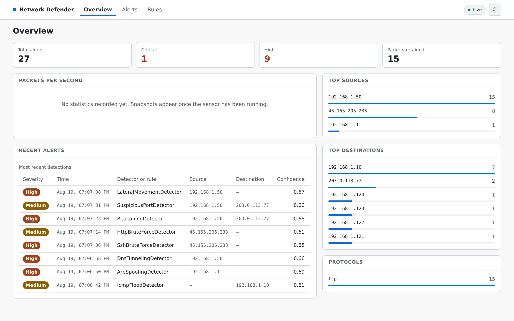
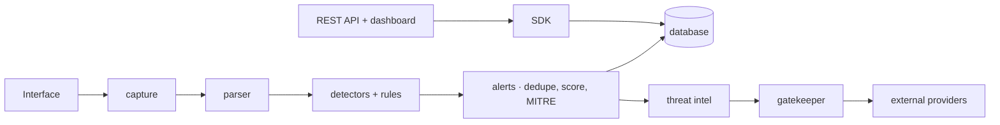

# Network Defender


A modular network intrusion detection system in Python. It watches a network
passively, raises alerts from thirteen heuristic detectors and a YAML
signature engine, enriches them with threat intelligence, and serves them
through a REST API and a live dashboard.



## What it does

- **Passive capture** with Scapy — BPF filters, protocol allow/deny lists,
  rate limiting, and PCAP replay through the same code path as live traffic.
- **Thirteen detectors** covering reconnaissance, floods, credential guessing,
  command and control, exfiltration and lateral movement. Each is explained in
  [docs/DETECTORS.md](docs/DETECTORS.md), including what it confuses with.
- **A YAML signature engine**, reloadable at runtime, with windowed
  aggregation. See [docs/RULE_SCHEMA.md](docs/RULE_SCHEMA.md).
- **Alerting** with deduplication, confidence scored against the configured
  thresholds, and MITRE ATT&CK attribution.
- **Threat intelligence enrichment** — reputation, geolocation and RDAP —
  behind a gatekeeper that owns every rate limit, queue and circuit breaker.
- **A REST API and a React dashboard**, with a live WebSocket feed.
- **Measured detection quality.** A 49-case labelled corpus, a 777-point
  parameter sweep, and the recommendations that came out of it:
  [docs/DETECTION_TUNING.md](docs/DETECTION_TUNING.md).

## Before you rely on it

This is a working system with a known, measured problem. Every detector runs
on a five-second evaluation window while nine of them are configured for sixty
seconds or more, because the per-detector `time_window_seconds` is declared,
validated, reported by `GET /config` — and read by no code. Measured across
777 grid points:

> **Five of the twelve tunable detectors have a recall of 0.00 on live traffic
> as shipped**, and three more sit at or below 0.5.

[docs/DETECTION_TUNING.md](docs/DETECTION_TUNING.md) has the numbers, the
one-line configuration change that recovers most of it, and the fix that
removes the cause. It is the first item on the [roadmap](docs/ROADMAP.md).

Saying so here rather than shipping quietly is the point: a control someone
believes in and does not have is worse than one they know they lack.

## Quick start

Requires Python 3.12+ and [uv](https://docs.astral.sh/uv/).

```bash
git clone <repository-url> && cd network-defender
uv sync
uv run network-defender replay tests/data/pcaps/tcp_port_scan.pcap
```

```
3 alert(s) from tcp_port_scan.pcap:

  high     TcpPortScanDetector        confidence 0.75  45.155.205.233
           TCP Port Scan detected: 40 unique ports scanned.
  high     SynScanDetector            confidence 0.83  45.155.205.233
           SYN Scan detected: 40 unique ports targeted.
  medium   TCP Port Scan              confidence 0.85  45.155.205.233
           Rule 'TCP Port Scan' matched: 3 condition(s) satisfied.
```

No privileges, no interface, nothing to configure. Thirteen sample captures
ship in `tests/data/pcaps/`, one per attack —
[docs/EXAMPLE_ATTACKS.md](docs/EXAMPLE_ATTACKS.md) walks through all of them.

## Usage

Three ways to run it, because they need different privileges.

**Replay a capture file** — the fastest way to see a detector work:

```bash
uv run network-defender replay path/to/capture.pcap --settle 30
```

**Serve the API and dashboard** — no capture, so no elevated privileges:

```bash
cd frontend && npm install && npm run build && cd ..   # once, to build the SPA
uv run network-defender api                            # http://localhost:8000
uv run network-defender api --port 9000                # overrides api.port
```

| URL | What it is |
|---|---|
| `/dashboard` | The SOC dashboard |
| `/docs` | Swagger UI, with a request builder that works |
| `/redoc` | The same contract as reference prose |
| `/api/v1` | The REST API — [docs/API.md](docs/API.md) has a worked session |
| `/ws/live` | Alerts and counters, pushed as they happen |

**Capture live traffic** — needs `CAP_NET_RAW` (or root) and the interface
named by `capture.interface` in `config/setup.json`:

```bash
sudo -E uv run network-defender sensor
```

The sensor and the API are separate processes on purpose: only the sensor
needs raw-socket access, so the HTTP surface runs with no capture capability
at all. `python -m network_defender` is equivalent and needs no install.

## Architecture



Two rules hold the design up, and both are checked rather than asserted:

1. **The SDK is the sole entry point.** No router, script or CLI constructs or
   drives a service.
2. **The gatekeeper is the sole outbound path.** There is exactly one HTTP
   call site in the repository, inside a provider that cannot be constructed
   without a gatekeeper.

Full C4 diagrams, the deployment topology, and the four places the code
differs from the original plan: [docs/ARCHITECTURE.md](docs/ARCHITECTURE.md).

## Project structure

```
src/network_defender/    the library — capture, parser, detectors, rules,
                         services, database, api, sdk, cli, shared
frontend/                React + TypeScript dashboard (Vite)
config/                  detectors.json, setup.json, rate_limits.json
rules/                   YAML signature rules
scripts/                 pcap generation, benchmarks, sensitivity analysis
notebooks/               detection_analysis.ipynb
research/                committed sweep results
tests/                   unit/ mirrors src/; integration/, e2e/, performance/
docs/                    everything listed below
```

There is no `dashboard/`, `models/` or `utils/` package; the developer guide
[says where each of those lives and why](docs/DEVELOPER_GUIDE.md#project-structure).

## Configuration

Everything tunable is in `config/*.json`, versioned and validated at startup.
Secrets are environment variables only — copy `.env-example` to `.env`.

```bash
DATABASE_URL=sqlite:///./network_defender.db
API_KEY=                       # unset means the API is unauthenticated
ABUSEIPDB_API_KEY=             # an absent provider is skipped, not failed
ND__CAPTURE__INTERFACE=eth1    # any config field, addressed by its path
```

Every field in `config/setup.json` can be overridden by an `ND__SECTION__KEY`
environment variable, coerced to the field's type and validated at startup, so
a bad value fails fast and names itself. See
[docs/CONFIGURATION.md](docs/CONFIGURATION.md).

## Documentation

| | |
|---|---|
| **Start here** | [Example attacks](docs/EXAMPLE_ATTACKS.md) · [How detections work](docs/DETECTORS.md) · [Dashboard](docs/UI.md) |
| **Running it** | [Configuration](docs/CONFIGURATION.md) · [REST API](docs/API.md) · [Observability](docs/OBSERVABILITY.md) · [Credentials](docs/CREDENTIALS.md) |
| **Understanding it** | [Architecture](docs/ARCHITECTURE.md) · [Alert system](docs/ALERT_SYSTEM.md) · [Threat intel](docs/THREAT_INTEL.md) · [Rule schema](docs/RULE_SCHEMA.md) |
| **Judging it** | [Threat model](docs/THREAT_MODEL.md) · [Detection tuning](docs/DETECTION_TUNING.md) · [Sensitivity method](docs/SENSITIVITY_ANALYSIS.md) · [Roadmap and limitations](docs/ROADMAP.md) |
| **Working on it** | [Contributing](CONTRIBUTING.md) · [Developer guide](docs/DEVELOPER_GUIDE.md) · [Testing](docs/TESTING.md) · [Conventions](docs/CONVENTIONS.md) |
| **History** | [PLAN](docs/PLAN.md) · [PRD](docs/PRD.md) · [Code review](docs/CODE_REVIEW.md) · [TODO](docs/TODO.md) |

## Development

```bash
uv sync --all-groups      # runtime, dev and research dependencies
uv run pytest             # full suite with coverage; reports land in reports/
uv run ruff check
uv run mypy
uv run pre-commit install
```

1180+ tests at 97% branch coverage, gated at 85%. Unit tests mirror the source
tree one directory per package; end-to-end tests replay the sample captures
through the SDK with nothing mocked. Detector changes are additionally checked
by a mutation spot check, because coverage says a line ran and mutation
testing says whether the suite would have noticed it being wrong.

[CONTRIBUTING.md](CONTRIBUTING.md) has the standards and the pull request
process; [docs/DEVELOPER_GUIDE.md](docs/DEVELOPER_GUIDE.md) has recipes for
adding a detector or a threat intelligence provider.

## Status

Milestones 0–16 and 19–20 are complete. Docker (17) is not started. Of the CI
work (18), the test suite with its coverage gate, the dependency audit and the
secrets scan run on every push; lint and type checking run in the pre-commit
hooks but **not** in CI, and neither does a Docker build, a version matrix or
branch protection. Known limitations, with measurements, are in
[docs/ROADMAP.md](docs/ROADMAP.md).

## License

MIT — see [LICENSE](LICENSE).
