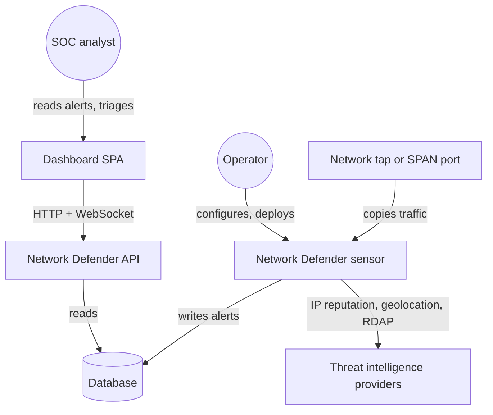
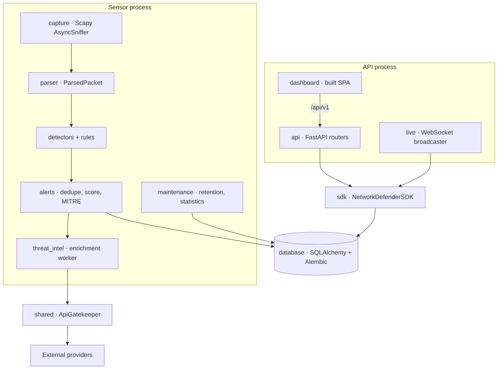
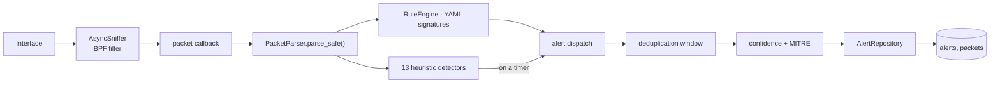
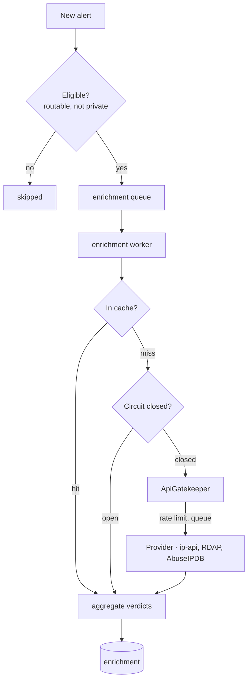
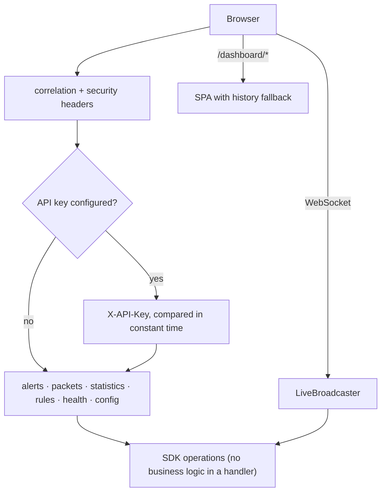
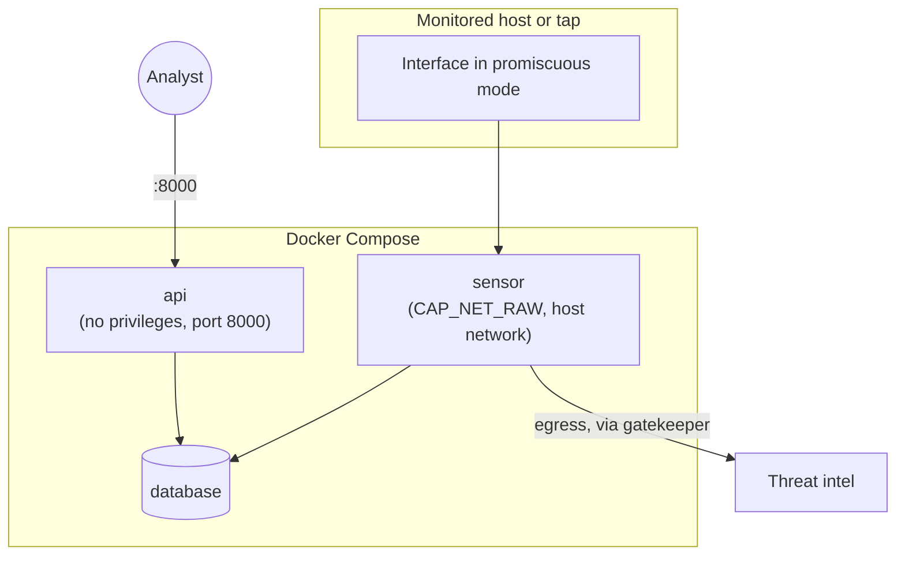

# Architecture

The system as built. [PLAN.md](PLAN.md) is the design document written at
Milestone 0 and kept as a record of what was intended; where the two differ,
this file is the one that matches the code, and the differences are called out
below rather than quietly reconciled.

Every diagram here renders — they are checked with `mermaid-cli`, because a
diagram that fails to parse is an error box on GitHub and nobody notices from
the source.

## Two rules the whole design rests on

**The SDK is the sole entry point.** No router, script or CLI constructs or
drives a service; they call `NetworkDefenderSDK`. That is what keeps the REST
API, the dashboard and anything embedding this library from drifting apart,
and it is checked: a repository-wide search for the seven service classes
outside `sdk/` and `services/` finds none.

The boundary is about *behaviour*, not about namespaces. Routers and
repositories do import model types from `services/*/models.py` — `Alert`,
`ThreatIntelResult`, `ProviderResult` — because those are the data contract
and copying them would be worse. Importing a type is not reaching past the
SDK; calling a service is.

**The gatekeeper is the sole outbound path.** Every external call goes through
`ApiGatekeeper`, which owns the rate limits, the queue and the circuit
breaker. A provider cannot be constructed without one. A search for `httpx`,
`requests`, `urllib` and `aiohttp` across the repository finds exactly one
call site, inside a provider that already holds a gatekeeper.

## Level 1 — Context

The sensor is passive. It never transmits on the monitored segment, which is
what lets it sit on a tap and what makes "does it drop packets" the only
availability question worth asking about it.

## Level 2 — Containers

The two processes are separate on purpose, and the reason is in
`api/app.py`'s docstring: the API starts only the database service, so it
needs no `CAP_NET_RAW` and can be restarted or scaled without dropping a
packet, because nothing is capturing in it.

## Level 3 — Components

### The capture pipeline

`parse_safe` swallows a malformed packet rather than raising, and one
detector's exception is caught and logged rather than stalling the loop. Both
are deliberate: a sensor that stops on the first strange packet is a sensor an
attacker can turn off by sending one.

PCAP replay reuses the same callback rather than a parallel path, which is why
the end-to-end tests exercise the code that runs in production.

### Detection

See [PLAN.md §2 Level 3](PLAN.md) for the class hierarchy and
[DETECTORS.md](DETECTORS.md) for what each detector measures.

### Threat intelligence

Enrichment is asynchronous and best-effort by design: an alert is worth
raising whether or not a third party is reachable, so an outage degrades
enrichment rather than detection. [THREAT_INTEL.md](THREAT_INTEL.md) has the
details.

### API and dashboard

## Level 4 — Code

The one path worth reading at this level is a packet becoming an alert. It is
three calls deep and every hop is synchronous:

`CaptureService._on_packet` → `PacketParser.parse_safe` →
`DetectionService.process_packet` → (`RuleEngine.evaluate` immediately, and
`BaseDetector.ingest` accumulating) → `PeriodicEvaluator` →
`BaseDetector.evaluate` → `dispatch_detector_alert` → `AlertService.handle` →
`AlertRepository.create`.

`ingest` is on the hot path and must be cheap — a counter update, not a
decision. The decision lives in `evaluate`, which runs on a timer. Ingest
throughput measures around 95 000 packets/second against a 500 pkt/s floor;
[TESTING.md](TESTING.md) explains why the floor is set two orders of magnitude
below the measurement.

## Deployment

Only the sensor is privileged, and only the sensor makes outbound calls. The
API container needs neither, which means the internet-facing surface is the
one with the fewest capabilities. **Milestone 17 has not been implemented, so
no Dockerfile or Compose file exists yet** — this is the topology those files
should express, not a description of shipped artefacts.

## Where this differs from PLAN.md

| PLAN.md says | Actually | Why |
|---|---|---|
| A `Detector Manager` | `DetectorRegistry` discovers, `DetectionService` orchestrates | Discovery and orchestration are different jobs and one class doing both could not be tested separately. |
| Every detector subclasses `BaseDetector` directly | Two intermediate base classes absorb the shared counting and breadth loops | Milestone 15; six detectors were carrying copies of the same twenty lines. |
| `dashboard/`, `models/`, `utils/` packages | `frontend/` plus one router, per-package models, `shared/` | See [DEVELOPER_GUIDE.md](DEVELOPER_GUIDE.md) § Project structure. |
| Per-detector time windows | One shared evaluation interval | Not a decision — a defect, measured in [DETECTION_TUNING.md](DETECTION_TUNING.md) and open under Milestone 21. |
