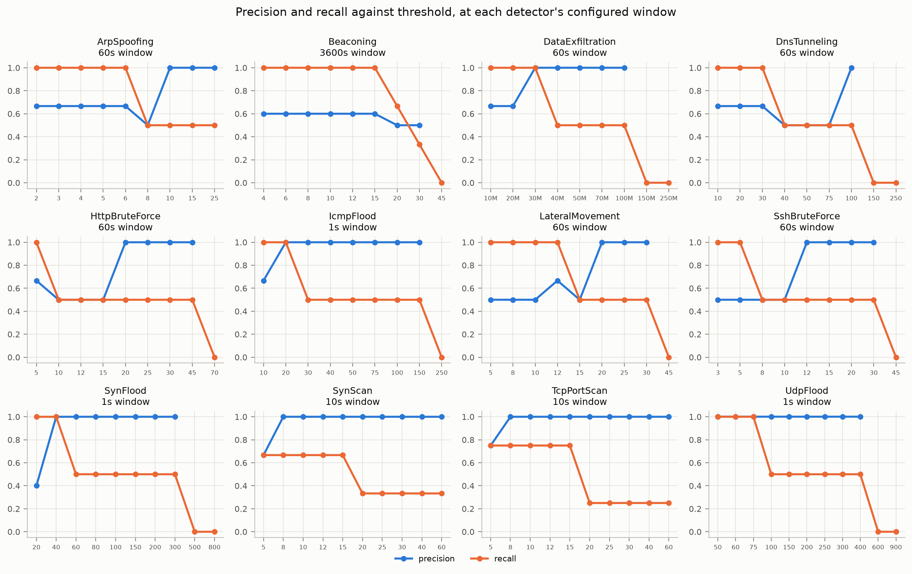

# Detection tuning — findings and recommended defaults

What the sensitivity analysis measured, what it changed my mind about, and
what the defaults are. The method is in
[SENSITIVITY_ANALYSIS.md](SENSITIVITY_ANALYSIS.md), the working in
`notebooks/detection_analysis.ipynb`, and the raw numbers in `research/`.

Every figure below is measured against a 49-case labelled corpus, half of it
benign traffic deliberately shaped like an attack. That is a small corpus and
a synthetic one, and the last section says what follows from that.

## The short version

**The thresholds were mostly right. The window was not implemented.**

Twelve detector configurations declared a `time_window_seconds`. No detector
read it. Every detector ran with whatever `detection.evaluation_interval_seconds`
happened to be — five seconds — so nine detectors configured to watch between
a minute and an hour watched five seconds, and three configured to watch one
second watched five.

Giving each detector the window it already declared raises mean recall across
the twelve tunable detectors from **0.41 to 0.62 with no threshold change at
all**, and takes the number of detectors that never fire from five to zero.
Four thresholds then move, and retuning takes the mean to **0.74**.

On half an hour of composed traffic containing five attacks, that is the
difference between ten alerts of which five were about nothing and four
attacks found, and seven alerts of which one was about nothing and all five
found.

## 1. `time_window_seconds` was not read by anything

It was validated by the config model, it was in `config/detectors.json`, it
was reported by `GET /config` — and no detector read it. Detector state was
cleared by `evaluate()`, and `PeriodicEvaluator` called that on one shared
timer. A configuration reading "100 SYNs in 1 second" or "10 login attempts in
60 seconds" described behaviour the code did not implement.

This is the same defect class as the confidence thresholds fixed in Milestone
15 and `retention_days` fixed in Milestone 16: a value copied into
configuration, believed by operators, ignored by code. It is the largest one
found, because unlike those two it silently cost detections.

What it cost, at the thresholds that shipped before this pass:

| Detector | declares | recall, window ignored | recall, window honoured |
|---|---|---|---|
| BeaconingDetector | 3600s | 0.00 | 1.00 |
| DataExfiltrationDetector | 60s | 0.00 | 0.50 |
| DnsTunnelingDetector | 60s | 0.00 | 0.50 |
| HttpBruteForceDetector | 60s | 0.00 | 0.50 |
| LateralMovementDetector | 60s | 0.00 | 0.50 |
| TcpPortScanDetector | 10s | 0.25 | 0.75 |
| ArpSpoofingDetector | 60s | 0.50 | 1.00 |
| SshBruteForceDetector | 60s | 0.50 | 0.50 |
| SynScanDetector | 10s | 0.67 | 0.67 |
| IcmpFloodDetector | 1s | 1.00 | 0.50 |
| SynFloodDetector | 1s | 1.00 | 0.50 |
| UdpFloodDetector | 1s | 1.00 | 0.50 |
| **mean** | | **0.41** | **0.62** |

The three floods are the interesting rows. They *lose* recall when given the
window they asked for, and they are the reason the fix comes with threshold
changes rather than without: a flood is defined by rate, and a count threshold
set for a five-second window is five times too strict for a one-second one.
Their thresholds had been fitted to the broken behaviour. Section 2 unfits
them, and all three go to 1.00.

Seen as curves — each detector at its configured window, every panel showing
the trade-off a threshold is supposed to express, recall falling as precision
climbs and a crossover between them, which is the tuning decision:

Before the fix, five of these panels were flat on zero recall across the whole
threshold range: no setting of the number an operator was offered moved them.

Searching the window axis as well says the window is the dominant parameter
and the threshold the fine adjustment. In most panels the gradient runs left
to right, along the window, rather than up and down along the threshold:

The corpus shows three genuinely different regimes, and this is why one shared
interval could never have served them:

- The **flood detectors want one second**, where a flood is separable from a
  busy server *by rate*. Stretched to a minute they are volume detectors, and
  a web server taking 300 connections a minute looks exactly like a moderate
  SYN flood.
- The **breadth and count detectors want ten to sixty seconds.** A twelve-port
  scan over two minutes has nothing to accumulate in five.
- **Beaconing wants an hour**, which is what its configuration always said. At
  sixty seconds it catches one beacon of three; at 3600 it catches all three.

## 2. The defaults

The evaluation interval **stays at 5.0 seconds**. It is no longer a detection
parameter: it decides how soon an alert can surface, not whether it is found.
A shorter interval is now strictly better, because it only costs CPU. An
earlier draft of this document recommended raising it to sixty; that was an
interim measure for a broken window, and the trade is gone.

Four thresholds change. Everything else keeps the value it shipped with, which
is the part of this result that was not expected.

| Setting | Was | Now | Why |
|---|---|---|---|
| `SynFloodDetector.syn_count_threshold` | 100 | **40** | At the one-second window the busiest benign second is twenty SYNs to one destination — a web server taking 300 connections over ten seconds, and an aggressive port scan. Forty leaves a 2.0x margin and takes recall from 0.5 to 1.0: a moderate flood runs at fifty a second, which a hundred never saw. |
| `UdpFloodDetector.udp_count_threshold` | 200 | **75** | No benign case reaches even fifty datagrams in a second; the busiest is a VoIP stream at forty. Seventy-five leaves a 1.9x margin and takes recall from 0.5 to 1.0 — a moderate flood runs at eighty-three a second. |
| `IcmpFloodDetector.icmp_count_threshold` | 50 | **20** | The busiest benign second is ten echo requests, from a traceroute. Twenty leaves a 2.0x margin and takes recall from 0.5 to 1.0. |
| `SshBruteForceDetector.connection_count_threshold` | 10 | **12** | Configuration management opening one SSH session per managed host reaches exactly ten, the shipped value, so it alerted today. Twelve clears it. Recall is unchanged: the low-and-slow attack is below both. |

The rule for moving one: it must buy recall, and it must leave visible
headroom over the busiest benign case in the corpus. The margin is quoted for
each, because a threshold fitted to one fixture's volume is not a
recommendation, it is a coincidence.

The UDP threshold is the one number here the original sweep could not have
produced. Its grid stepped 50 then 100, and the entire decision — a VoIP
stream at forty a second against a moderate flood at eighty-three — lives
between those two points. The grid was widened for that detector and the sweep
re-run. A parameter search that steps over the answer reports that no answer
exists, which is indistinguishable from there being none.

### What that configuration does

Replayed over half an hour of traffic with five attacks in it
(`research/alert_timeline.csv`):

| Configuration | Attacks detected | Alerts raised | Of those, about nothing |
|---|---|---|---|
| Thresholds as they shipped before this pass | 4 of 5 | 10 | 5 |
| The sweep's highest-F1 point | 5 of 5 | 14 | 8 |
| **Recommended, and now shipped** | **5 of 5** | **7** | **1** |

## 3. Why the highest-F1 configuration is not the recommendation

The sweep's own optimum finds all five attacks and raises eight false alarms
in half an hour — sixteen an hour on a segment this quiet — and an analyst
stops reading a console at that rate.

F1 is misleading here for a specific, structural reason: **the corpus is half
attacks and production is not.** A false-positive rate is measured against 23
negative cases; a real segment offers millions of opportunities. Any score
that balances precision against recall on a balanced corpus will
systematically favour a lowered threshold, and the more imbalanced the real
world is relative to the corpus, the more it over-favours it.

It also buys its recall with window length. Five detectors score highest at
300 seconds rather than the ten or sixty they ask for. That is not free even
when the alert arrives at the same moment: the evidence behind it is five
minutes of traffic rather than ten seconds of it, and someone has to read all
of it to decide. Nothing in an F1 score prices that.

So the recommendation is taken from a different operating point: **the most
sensitive threshold at which the detector stays silent on every benign case in
the corpus, at its own window.** `recommendation.clean_points` computes it and
`recommendation.benign_ceiling` quotes the margin. It is a necessary
condition, not a sufficient one — 23 benign cases cannot certify a detector
against real traffic — but it does not have F1's bias.

Searching both axes at once for a clean point does have its own failure mode,
which is why `clean_points` is evaluated at each detector's own window: over
the whole grid it finds operating points that are clean only because the
window is too short for anything to accumulate, which is a way of scoring well
by not looking.

## 4. Detectors no threshold can fix

For five detectors the benign and malicious ranges *overlap* at the detector's
own window: the largest benign case scores above the smallest attack, so every
threshold either misses an attack or reports a legitimate host. These are
recorded — in prose here and in `sensitivity.proposal.UNSEPARABLE_BY_THRESHOLD`
in code — so a future tuning pass does not rediscover them by fitting a
threshold to one benign case's volume, which is what the first draft of this
document did.

| Detector | The overlap | The signal that would separate them |
|---|---|---|
| `BeaconingDetector` | A health check every ten seconds is as regular as a beacon and reaches the same count. | Destination reputation, or a known-good list. Not a different count. |
| `DnsTunnelingDetector` | Encoded reputation lookups reach 75 queries a minute; the tunnel reaches 100. | A registered-domain allowlist — **built in Milestone 21**, and shipping empty. One entry for the vendor's domain closes this; the mechanism is the deliverable, the list is the operator's. |
| `DataExfiltrationDetector` | A video call reaches 20 MB a minute; a staged archive reaches 30. | `allowed_destinations`. **Narrowed in Milestone 21**: the detector now counts only bytes that leave the estate, which removed the 50 MB nightly backup that used to be the overlap. See below. |
| `ArpSpoofingDetector` | Duplicate-address detection after a lease renewal reaches 8 packets; a light poisoner sends 6. | MAC-to-IP mapping surveillance, which the detector's own docstring names as the thing it simplified away. The shipped threshold of 5 alerts on both and is kept: ARP poisoning is worth a false positive that one allowlist entry removes. |
| `LateralMovementDetector` | A monitoring server polls 15 hosts; a contained lateral sweep reaches 12. | Which hosts are supposed to fan out. The shipped threshold of 20 is clean but misses the smaller sweep. |

### The two Milestone 21 closed, and how far

**Exfiltration** counted every byte a host sent, so a nightly backup to an
internal file server — 50 MB, exactly the shipped threshold — was the largest
benign case and no threshold cleared it. Bytes that never leave the estate are
not exfiltration by any definition, so this was a rule, not a number. With
internal destinations excluded the detector's false positives on the corpus go
to zero, and the overlap that remains is narrower and more honest: a video
call at 20 MB a minute against a 30 MB staged archive.

A threshold of 30 MB would catch both attack cases with a 1.5x margin over
that call. It is not taken. 30 MB a minute is four megabits a second, which an
ordinary video call or a software update reaches, and one corpus case is not
enough evidence to bet an operator's console on. `allowed_destinations` is the
better instrument, and it is now there to use.

**DNS tunnelling** gained `allowed_domains`, matched on the *registered*
domain rather than the hostname — a tunnel's whole technique is that every
query name is different, so an allowlist of names would never match one, and
an allowlist of suffixes would match anything ending in the right characters.
An allowed query is not counted at all rather than counted and excused, so it
cannot dilute the high-entropy majority either.

The shipped list is empty, and the measured false positive therefore stands.
Filling it with `rep.example` because that is what the corpus fixture uses
would be fitting a default to a test, and the number it improved would mean
nothing. The names worth trusting are a given site's own.

That is the general shape of this section: where a detector is beaten by
something it cannot see, the fix is to let it see — and where what it needs to
see is local knowledge, the fix is a mechanism and an empty default, not a
better guess.

## 5. Windows slide, and each episode is one alert

Two behaviours that the composed timeline caught and the isolated sweep could
not, both now fixed rather than merely reported:

- **Windows were tumbling and anchored to process start.** `evaluate()`
  cleared state, so a window's boundaries were fixed by when the sensor
  started rather than by when traffic arrived. The once-a-second availability
  ping landed astride a boundary in six of its nine appearances; the DNS
  tunnel's 120 queries split 97 / 24 across one, taking a detection that needs
  100 down to 97. Identical traffic, different verdict, decided by phase.
  Windows now slide over *capture* time — the clock comes from packet
  timestamps, so a replay of the same PCAP gives the same answer every time.
- **A sustained attack was one alert per evaluation.** A flood lasting a
  minute produced twelve alerts at a five-second interval, which is the same
  finding twelve times. Each detector now reports a given key once per
  episode, and re-arms when the condition clears.

The second one interacts with the first: because the window slides, a burst is
counted once wherever it falls, so the alert that survives deduplication is
about the whole burst rather than about the fraction of it that happened to
land inside a bucket.

## 6. What these numbers are not

- **The corpus is synthetic and small.** 26 attack cases and 23 benign ones,
  all generated. It contains the confusions its author thought of, and it
  cannot report a false positive nobody imagined. Replaying labelled real
  captures is the obvious next step and would change some of these numbers.
- **Precision here is not precision in production.** See section 3. Treat the
  false-positive *rates* as ordering information, not as forecasts.
- **One behaviour per case.** A detector that behaves well in isolation can
  still drown in a busy segment; the timeline is a first look at that and not
  a substitute for a real one.
- **Detection, not attribution.** A case counts as detected if the detector
  fired at all. Whether the alert named the right host, and whether its
  severity and confidence were useful, is not scored.
- **`SuspiciousPortDetector` is unswept.** Its operating point is a port list,
  not a number. The corpus notes that the shipped list flags an ordinary IRC
  client, which is a policy question rather than a tuning one.
