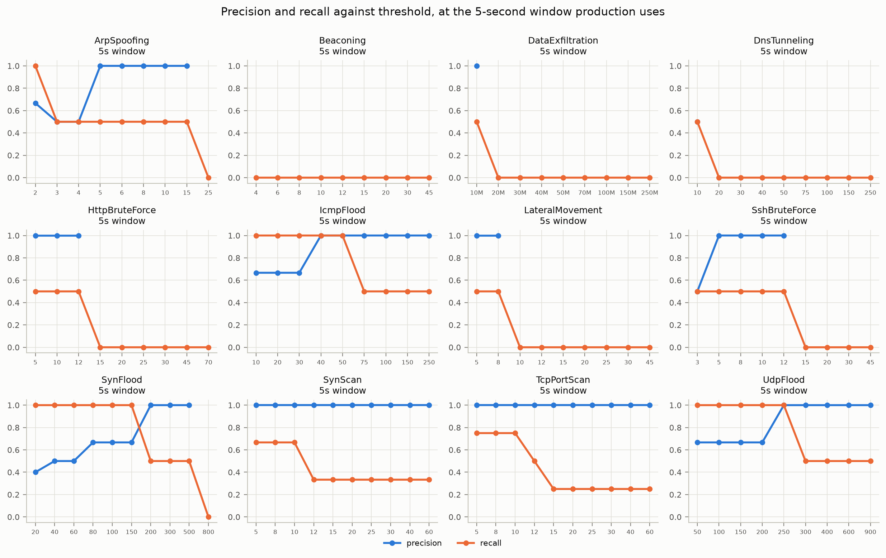
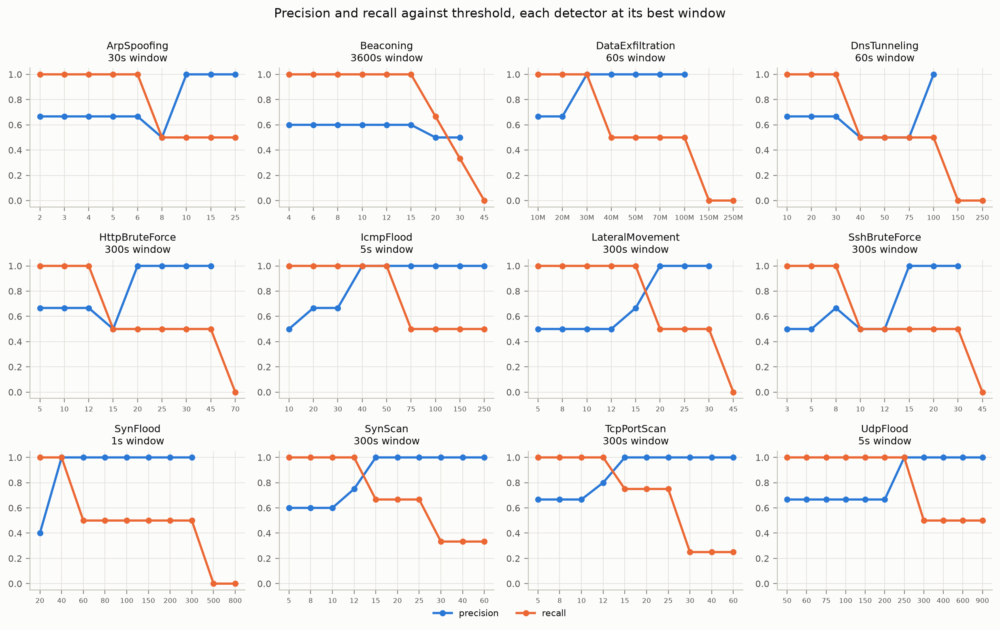
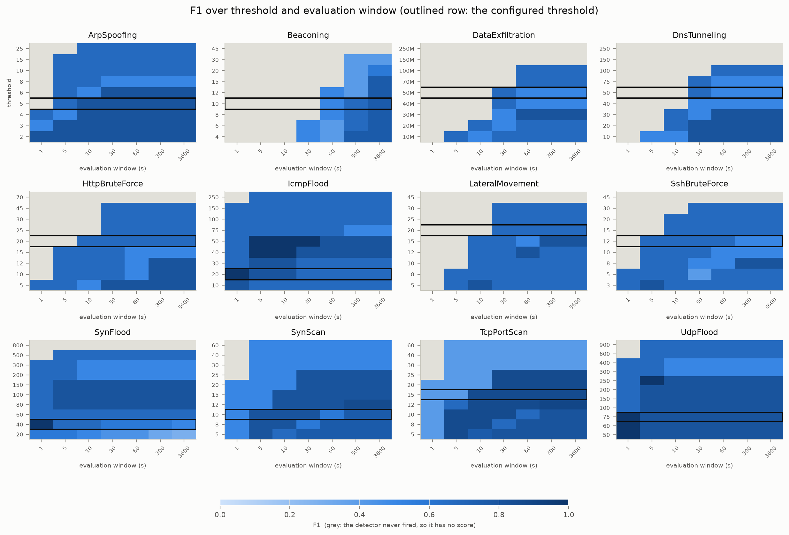
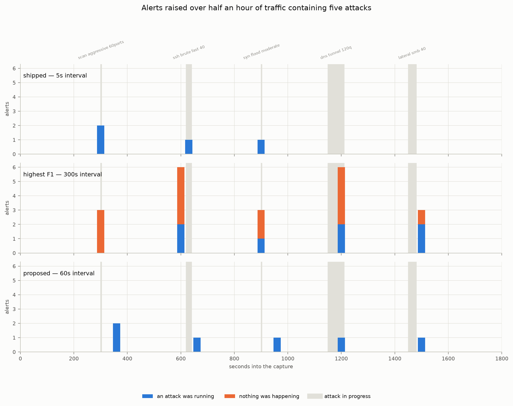

# Detection tuning — findings and recommended defaults

What the sensitivity analysis measured, what it changed my mind about, and
what the defaults should be. The method is in
[SENSITIVITY_ANALYSIS.md](SENSITIVITY_ANALYSIS.md), the working in
`notebooks/detection_analysis.ipynb`, and the raw numbers in `research/`.

Every figure below is measured against a 49-case labelled corpus, half of it
benign traffic deliberately shaped like an attack. That is a small corpus and
a synthetic one, and the last section says what follows from that.

## The short version

**The thresholds are mostly right. The window is wrong.**

Three shipped thresholds already sit exactly on the point where the detector
stops firing on every benign case in the corpus, and most of the rest are
within one grid step of it. Meanwhile five of the twelve tunable detectors
have a recall of **0.00** as shipped, and three more sit at or below 0.5 —
because every detector is being run with a five-second window, and nine of
them are configured for windows between sixty seconds and an hour.

Changing one number in `config/setup.json`, plus three thresholds, takes the
composed half-hour scenario from three of five attacks detected to five of
five, with no false alarms in either case.

## 1. `time_window_seconds` is not read by anything

Twelve detector configurations declare a `time_window_seconds`. It is
validated by the config model, it is in `config/detectors.json`, it is
reported by `GET /config` — and no detector reads it.

Detector state is cleared by `evaluate()`, and `evaluate()` is called by
`PeriodicEvaluator` on one shared timer taken from
`detection.evaluation_interval_seconds` in `config/setup.json`, which ships at
**5.0 seconds**. So the effective window for every detector is five seconds,
and a configuration reading "100 SYNs in 1 second" or "10 login attempts in 60
seconds" describes behaviour the code does not implement.

This is the same defect class as the confidence thresholds fixed in Milestone
15 and `retention_days` fixed in Milestone 16: a value copied into
configuration, believed by operators, ignored by code. It is the largest one
found so far, because unlike those two it silently costs detections.

What it costs, at the shipped thresholds:

| Detector | recall @ 5s (shipped) | recall @ 60s | declares |
|---|---|---|---|
| BeaconingDetector | 0.00 | 0.33 | 3600s |
| DataExfiltrationDetector | 0.00 | 0.50 | 60s |
| DnsTunnelingDetector | 0.00 | 0.50 | 60s |
| HttpBruteForceDetector | 0.00 | 0.50 | 60s |
| LateralMovementDetector | 0.00 | 0.50 | 60s |
| TcpPortScanDetector | 0.25 | 0.75 | 10s |
| ArpSpoofingDetector | 0.50 | 1.00 | 60s |
| SshBruteForceDetector | 0.50 | 0.50 | 60s |
| SynScanDetector | 0.67 | 0.67 | 10s |
| IcmpFloodDetector | 1.00 | 1.00 | 1s |
| SynFloodDetector | 1.00 | 1.00 | 1s |
| UdpFloodDetector | 1.00 | 1.00 | 1s |

Mean recall rises from 0.41 to 0.69. The three detectors that lose nothing are
the three whose declared window is short enough that the implementation
happens to match it.

The same thing seen as curves — at the window production runs, five detectors
are flat on zero recall across their whole threshold range, so no setting of
the number an operator is offered moves them:

Given the window each configuration asks for, every panel shows the trade-off
a threshold is supposed to express — recall falling, precision climbing, and a
crossover between them, which is the tuning decision:

Varying both parameters at once says the same thing in one picture. In nine of
the twelve panels the gradient runs left to right — along the window — and the
outlined row, the threshold that ships, crosses grey cells at the left edge
where production sits:

**Recommendation: make the field real.** Give each detector the window it
already declares. That is not cosmetic — the corpus shows three genuinely
different regimes, and no single interval serves them:

- The **flood detectors want one second**, where they score a perfect F1 and
  where a flood is separable from a busy server *by rate*. Stretched to a
  minute they are volume detectors, and a web server taking 300 connections a
  minute looks exactly like a moderate SYN flood.
- The **breadth and count detectors want sixty seconds.** A twelve-port scan
  over two minutes has nothing to accumulate in five.
- **Beaconing wants an hour**, which is what its configuration says. At sixty
  seconds it catches one beacon of three; at 3600 it catches all three.

## 2. Recommended defaults

Until per-detector windows exist, one interval has to be chosen. **Sixty
seconds** is where mean recall peaks with the detectors still clean on the
benign corpus. Three thresholds change with it:

| Setting | Now | Recommended | Why |
|---|---|---|---|
| `detection.evaluation_interval_seconds` | 5.0 | **60.0** | Section 1. |
| `SynScanDetector.unique_ports_threshold` | 10 | **12** | Benign port fanout tops out at 10 — a load balancer probing ten service ports, a monitoring agent taking a fourteen-port inventory. Ten is exactly the shipped value, so both alert today. |
| `SshBruteForceDetector.connection_count_threshold` | 10 | **12** | Configuration management reaches ten SSH sessions from one host, again exactly the shipped value. The forty-attempt attack registers thirty and is unaffected. |
| `IcmpFloodDetector.icmp_count_threshold` | 50 | **100** | *Only while the interval is 60s.* Fifty ICMP packets per second is a flood; fifty per minute is a host pinged once a second. Revert to 50 when the detector gets its declared one-second window. |

Everything else keeps its shipped value. That is the unexpected part of this
result: `HttpBruteForceDetector` at 20, `LateralMovementDetector` at 20 and
`IcmpFloodDetector` at 50 sit *exactly* on the zero-false-positive point at a
sixty-second window, and `TcpPortScanDetector` at 15 is one step above it.

### What that configuration does

Replayed over half an hour of traffic with five attacks in it
(`research/alert_timeline.csv`):

| Configuration | Attacks detected | Alerts raised | Of those, about nothing |
|---|---|---|---|
| Shipped — 5s interval | 3 of 5 | 4 | 0 |
| Highest F1 — 300s interval | 5 of 5 | 23 | 16 |
| **Proposed — 60s interval** | **5 of 5** | **6** | **0** |

## 3. Why the highest-F1 configuration is not the recommendation

The sweep's own optimum is a 300-second interval with most thresholds lowered:
it reaches the highest mean F1 available at any single interval, 0.808.
Replayed over the timeline it raises **sixteen false alarms in half an hour** — about
thirty-two an hour on a segment this quiet — and an analyst stops reading a
console at that rate.

F1 is misleading here for a specific, structural reason: **the corpus is half
attacks and production is not.** A false-positive rate is measured against 23
negative cases; a real segment offers millions of opportunities. Any score
that balances precision against recall on a balanced corpus will systematically
favour a lowered threshold, and the more imbalanced the real world is relative
to the corpus, the more it over-favours it.

The second cost is latency, which no F1 score prices at all. A 300-second
interval means the port scan at t=300 is reported at t=600. The window that
buys recall is also the delay before anyone hears about it.

So the recommendation is taken from a different operating point: **the most
sensitive threshold at which the detector stays silent on every benign case in
the corpus.** `recommendation.precision_first_thresholds` computes it. It is a
necessary condition, not a sufficient one — 23 benign cases cannot certify a
detector against real traffic — but it does not have F1's bias.

## 4. Detectors no threshold can fix

For five detectors the benign and malicious ranges *overlap*: the largest
benign case scores above the smallest attack, so every threshold either misses
an attack or reports a legitimate host. These are recorded so a future tuning
pass does not rediscover them by fitting a threshold to one benign case's
volume, which is what the first draft of this document did.

| Detector | The overlap | The signal that would separate them |
|---|---|---|
| `DnsTunnelingDetector` | Encoded reputation lookups reach 75 queries; the tunnel reaches 100 — and 100 is *exactly* the tunnel's count, so a window boundary splitting it loses the detection. | A registered-domain allowlist. Entropy and volume are both already used and neither distinguishes an endpoint agent's encoded lookups from a tunnel. |
| `DataExfiltrationDetector` | A nightly backup moves 50 MB; a staged archive moves 30 MB. | The destination — internal, known-good, or neither. The detector's docstring is explicit that it does not look, and this is what that costs. |
| `ArpSpoofingDetector` | Duplicate-address detection after a lease renewal reaches 8 packets; a light poisoner sends 6. | MAC-to-IP mapping surveillance, which the detector's own docstring names as the thing it simplified away. |
| `SynFloodDetector` | At a minute-long window a busy web server reaches 300 new connections and a moderate flood 150. | Rate. Separable at the one-second window the configuration already declares. |
| `UdpFloodDetector` | An RTP stream reaches 400 datagrams a minute; a moderate flood 250. | Rate, same as above. |

The last two are not really detector defects. They are section 1 again.

## 5. Windows are tumbling, and anchored to process start

`evaluate()` clears state, so a window is a tumbling bucket whose boundaries
are fixed by when the sensor started rather than by when traffic arrives. The
composed timeline caught two consequences the isolated sweep could not:

- The once-a-second availability ping lands astride a boundary in six of its
  nine appearances and inside a single window in three. Identical traffic,
  different verdict, decided by phase.
- The DNS tunnel's 120 queries split **97 / 24** across a boundary, taking a
  detection that needs 100 down to 97.

Two things follow. First, a sliding window — or overlapping windows, or a
decayed counter — would make detection independent of when the process
started, and is worth doing. Second, **the per-case numbers in the sweep are
optimistic by however much alignment luck each case got**, since each case is
replayed with the window anchored to its own first packet.

## 6. What these numbers are not

- **The corpus is synthetic and small.** 26 attack cases and 23 benign ones,
  all generated. It contains the confusions its author thought of, and it
  cannot report a false positive nobody imagined. Replaying labelled real
  captures is the obvious next step and would change some of these numbers.
- **Precision here is not precision in production.** See section 3. Treat the
  false-positive *rates* as ordering information, not as forecasts.
- **One behaviour per case.** A detector that behaves well in isolation can
  still drown in a busy segment; the timeline is a first look at that and not
  a substitute for a real one.
- **Detection, not attribution.** A case counts as detected if the detector
  fired at all. Whether the alert named the right host, and whether its
  severity and confidence were useful, is not scored.
- **`SuspiciousPortDetector` is unswept.** Its operating point is a port list,
  not a number. The corpus notes that the shipped list flags an ordinary IRC
  client, which is a policy question rather than a tuning one.
