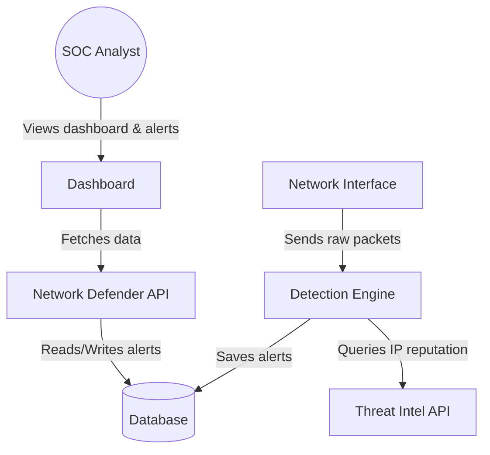
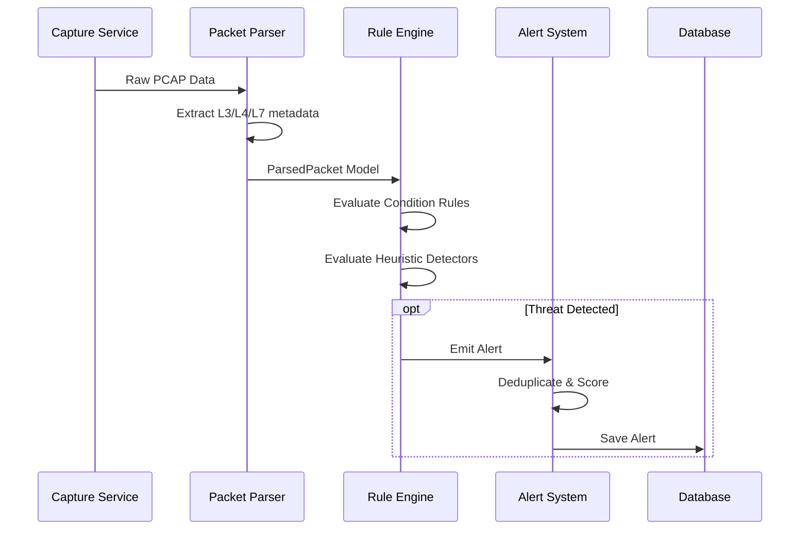

# Architecture & Planning Document (PLAN) - Network Defender

## 1. Overview
This document outlines the software architecture and technical planning for Network Defender. The system is designed using a layered architecture, enforcing strict boundaries between the core business logic, external interfaces, and infrastructure components.

## 2. C4 Model Diagrams

### Context Diagram (Level 1)


### Container Diagram (Level 2)
```mermaid
graph TD
    Capture[Packet Capture Module\n(Scapy)] -->|Raw Packets| Parser[Packet Parser]
    Parser -->|Parsed Packets| RuleEngine[Rule Engine & Detectors]
    RuleEngine -->|Generates Alerts| AlertSystem[Alert System]
    AlertSystem -->|Enriches| TIEngine[Threat Intel Service]
    TIEngine -->|Gatekeeper| ExternalAPI[External Threat Intel]
    AlertSystem -->|Persists| Database[(SQLite/PostgreSQL)]
    FastAPI[REST API\n(FastAPI)] -->|Queries| Database
    DashboardUI[Dashboard UI] -->|HTTP/WebSocket| FastAPI
```

### Component Diagram (Detection Layer) (Level 3)
```mermaid
graph TD
    Manager[Detector Manager] --> BaseDetector[Base Detector Interface]
    BaseDetector <|-- TCPScan[TCP Scan Detector]
    BaseDetector <|-- Beaconing[Beaconing Detector]
    BaseDetector <|-- DNSTunnel[DNS Tunnel Detector]
    Manager --> |Evaluates| Packets[Parsed Packet Stream]
    TCPScan --> AlertBus[Alert Bus]
    Beaconing --> AlertBus
    DNSTunnel --> AlertBus
```

## 3. Workflow UMLs

### Packet Processing Workflow


## 4. Deployment Diagram (Docker Compose)
```mermaid
graph TD
    subgraph Docker Host
        ND_Core[Network Defender Engine\n(Privileged, host network)]
        ND_API[FastAPI Server]
        ND_UI[Dashboard Frontend]
        DB[(Database Container)]
        
        ND_Core --> DB
        ND_API --> DB
        ND_UI --> ND_API
    end
    Internet((External Threat Intel)) <-- Gatekeeper --> ND_Core
```

## 5. Architecture Decision Records (ADRs)

### ADR 1: Use Scapy for Packet Capture
- **Context:** We need a reliable way to capture and parse packets in Python.
- **Decision:** Use Scapy.
- **Rationale:** Scapy provides excellent flexibility and readable protocol parsers. While slower than C-based alternatives (like libpcap bindings alone), our 10k pps target is achievable with optimized filtering, and the ease of development fits our maintainability goals.

### ADR 2: SDK-Based Architecture
- **Context:** Ensuring business logic isn't coupled to the REST API or CLI.
- **Decision:** Implement an internal SDK (`src/network_defender/sdk/sdk.py`).
- **Rationale:** The API, CLI, and internal background workers will only interact with the application through this SDK layer, ensuring consistent behavior, logging, and validation.

### ADR 3: Centralized API Gatekeeper
- **Context:** Uncontrolled outbound API calls to Threat Intel providers can lead to rate limiting, bans, or silent failures.
- **Decision:** Implement a centralized `ApiGatekeeper`.
- **Rationale:** All outbound API requests must pass through this gatekeeper, which will enforce rate limits, queueing, backpressure, and caching, providing a robust integration layer.

### ADR 4: No Single File > 150 Lines
- **Context:** Python projects often suffer from massive, monolithic files.
- **Decision:** Enforce a hard limit of 150 lines per file.
- **Rationale:** Forces single-responsibility modules, encourages composability, and massively improves readability for students and code reviewers.

## 6. API Contract Sketch

### Endpoints
- `GET /api/v1/alerts`
  - Query Params: `severity`, `limit`, `offset`, `time_range`
  - Response: List of `Alert` models.
- `GET /api/v1/alerts/{alert_id}`
  - Response: Detailed `Alert` model including raw packet snippet and Threat Intel enrichment data.
- `GET /api/v1/statistics`
  - Response: `{ "total_packets": int, "active_alerts": int, "top_ips": list }`
- `GET /api/v1/rules`
  - Response: List of loaded detection rules and their status.
- `POST /api/v1/rules/reload`
  - Response: `{ "status": "success", "loaded_rules_count": int }`
- `GET /api/v1/health`
  - Response: `{ "status": "ok", "components": {...} }`
