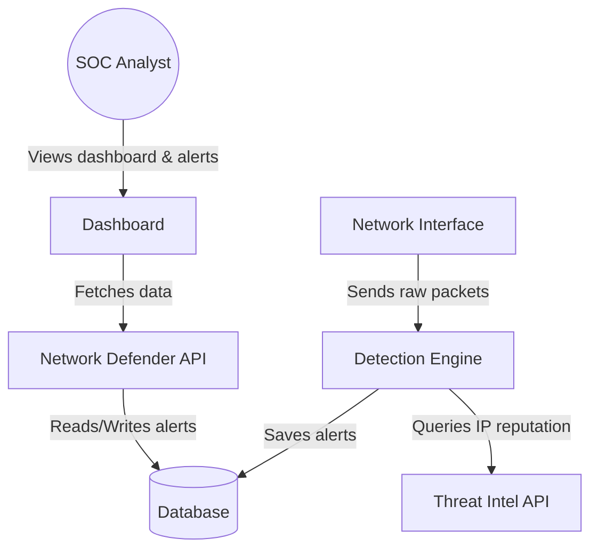
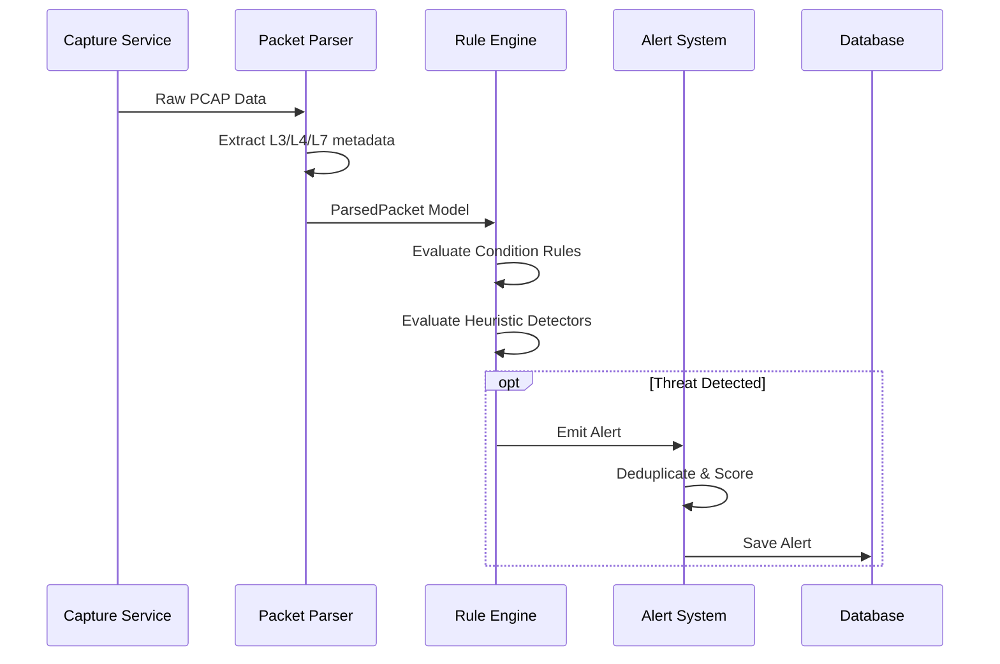
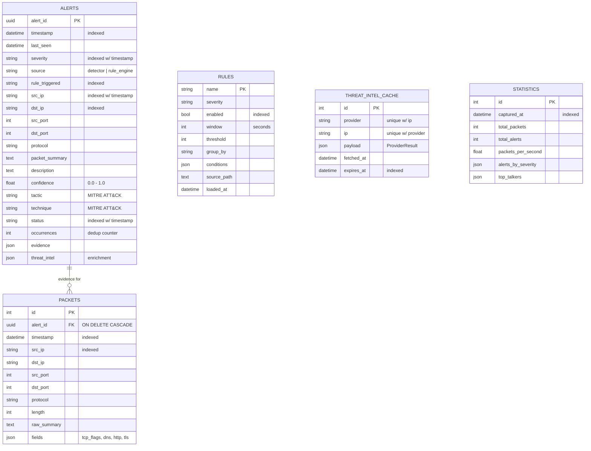

# Architecture & Planning Document (PLAN) - Network Defender

## 1. Overview
This document outlines the software architecture and technical planning for Network Defender. The system is designed using a layered architecture, enforcing strict boundaries between the core business logic, external interfaces, and infrastructure components.

## 2. C4 Model Diagrams

### Context Diagram (Level 1)

```mermaid
graph TD
    User((SOC Analyst)) -->|Views dashboard & alerts| Dashboard
    Dashboard -->|Fetches data| API[Network Defender API]
    API -->|Reads/Writes alerts| DB[(Database)]
    Capture[Network Interface] -->|Sends raw packets| Engine[Detection Engine]
    Engine -->|Queries IP reputation| TI[Threat Intel API]
    Engine -->|Saves alerts| DB
```

### Container Diagram (Level 2)
```mermaid
graph TD
    Capture[Packet Capture Module\n(Scapy)] -->|Raw Packets| Parser[Packet Parser]
    Parser -->|Parsed Packets| RuleEngine[Rule Engine & Detectors]
    RuleEngine -->|Generates Alerts| AlertSystem[Alert System]
    AlertSystem -->|Enriches| TIEngine[Threat Intel Service]
    TIEngine -->|Gatekeeper| ExternalAPI[External Threat Intel]
    AlertSystem -->|Persists| Database[(SQLite/PostgreSQL)]
    FastAPI[REST API\n(FastAPI)] -->|Queries| Database
    DashboardUI[Dashboard UI] -->|HTTP/WebSocket| FastAPI
```

### Component Diagram (Detection Layer) (Level 3)
```mermaid
graph TD
    Manager[Detector Manager] --> BaseDetector[Base Detector Interface]
    BaseDetector <|-- TCPScan[TCP Scan Detector]
    BaseDetector <|-- Beaconing[Beaconing Detector]
    BaseDetector <|-- DNSTunnel[DNS Tunnel Detector]
    Manager --> |Evaluates| Packets[Parsed Packet Stream]
    TCPScan --> AlertBus[Alert Bus]
    Beaconing --> AlertBus
    DNSTunnel --> AlertBus
```

## 3. Workflow UMLs

### Packet Processing Workflow

```mermaid
sequenceDiagram
    participant Capture as Capture Service
    participant Parser as Packet Parser
    participant Engine as Rule Engine
    participant Alert as Alert System
    participant DB as Database
    
    Capture->>Parser: Raw PCAP Data
    Parser->>Parser: Extract L3/L4/L7 metadata
    Parser->>Engine: ParsedPacket Model
    Engine->>Engine: Evaluate Condition Rules
    Engine->>Engine: Evaluate Heuristic Detectors
    opt Threat Detected
        Engine->>Alert: Emit Alert
        Alert->>Alert: Deduplicate & Score
        Alert->>DB: Save Alert
    end
```

## 4. Deployment Diagram (Docker Compose)
```mermaid
graph TD
    subgraph Docker Host
        ND_Core[Network Defender Engine\n(Privileged, host network)]
        ND_API[FastAPI Server]
        ND_UI[Dashboard Frontend]
        DB[(Database Container)]
        
        ND_Core --> DB
        ND_API --> DB
        ND_UI --> ND_API
    end
    Internet((External Threat Intel)) <-- Gatekeeper --> ND_Core
```

## 5. Architecture Decision Records (ADRs)

### ADR 1: Use Scapy for Packet Capture
- **Context:** We need a reliable way to capture and parse packets in Python.
- **Decision:** Use Scapy.
- **Rationale:** Scapy provides excellent flexibility and readable protocol parsers. While slower than C-based alternatives (like libpcap bindings alone), our 10k pps target is achievable with optimized filtering, and the ease of development fits our maintainability goals.

### ADR 2: SDK-Based Architecture
- **Context:** Ensuring business logic isn't coupled to the REST API or CLI.
- **Decision:** Implement an internal SDK (`src/network_defender/sdk/sdk.py`).
- **Rationale:** The API, CLI, and internal background workers will only interact with the application through this SDK layer, ensuring consistent behavior, logging, and validation.

### ADR 3: Centralized API Gatekeeper
- **Context:** Uncontrolled outbound API calls to Threat Intel providers can lead to rate limiting, bans, or silent failures.
- **Decision:** Implement a centralized `ApiGatekeeper`.
- **Rationale:** All outbound API requests must pass through this gatekeeper, which will enforce rate limits, queueing, backpressure, and caching, providing a robust integration layer.

### ADR 4: No Single File > 150 Lines
- **Context:** Python projects often suffer from massive, monolithic files.
- **Decision:** Enforce a hard limit of 150 lines per file.
- **Rationale:** Forces single-responsibility modules, encourages composability, and massively improves readability for students and code reviewers.

### ADR 5: Store Only Alert-Linked Packets
- **Context:** The schema calls for a `packets` table, but the system targets 10,000 packets/second — roughly 860 million rows per day.
- **Decision:** Persist only the packets that triggered an alert, linked to it by foreign key. Full traffic remains in PCAP files.
- **Rationale:** Analysts need the packet that caused a finding, not every packet on the wire. This keeps the evidence an investigation actually uses while making the write volume a rounding error, and avoids a table SQLite could not survive.

### ADR 6: Repository Pattern Over Direct ORM Access
- **Context:** Services could query SQLAlchemy directly, which is less code up front.
- **Decision:** Services depend on repository ports and receive domain models; only the repository layer imports SQLAlchemy.
- **Rationale:** Returning live ORM instances leaks session lifetime into the alert pipeline — detached-instance errors and lazy loads firing after a session closes. Returning detached domain models also keeps the in-memory and SQL repositories genuinely interchangeable, which is what makes the tests fast and the storage backend swappable.

## 6. Database Schema

SQLite in development, PostgreSQL-ready without code changes: no module above the repository layer names a backend, and the engine is the only place a URL or dialect appears.

### ERD

```mermaid
erDiagram
    ALERTS ||--o{ PACKETS : "evidence for"
    ALERTS {
        uuid     alert_id PK
        datetime timestamp "indexed"
        datetime last_seen
        string   severity "indexed w/ timestamp"
        string   source "detector | rule_engine"
        string   rule_triggered "indexed"
        string   src_ip "indexed w/ timestamp"
        string   dst_ip "indexed"
        int      src_port
        int      dst_port
        string   protocol
        text     packet_summary
        text     description
        float    confidence "0.0 - 1.0"
        string   tactic "MITRE ATT&CK"
        string   technique "MITRE ATT&CK"
        string   status "indexed w/ timestamp"
        int      occurrences "dedup counter"
        json     evidence
        json     threat_intel "enrichment"
    }
    PACKETS {
        int      id PK
        uuid     alert_id FK "ON DELETE CASCADE"
        datetime timestamp "indexed"
        string   src_ip "indexed"
        string   dst_ip
        int      src_port
        int      dst_port
        string   protocol
        int      length
        text     raw_summary
        json     fields "tcp_flags, dns, http, tls"
    }
    RULES {
        string   name PK
        string   severity
        bool     enabled "indexed"
        int      window "seconds"
        int      threshold
        string   group_by
        json     conditions
        text     source_path
        datetime loaded_at
    }
    THREAT_INTEL_CACHE {
        int      id PK
        string   provider "unique w/ ip"
        string   ip "unique w/ provider"
        json     payload "ProviderResult"
        datetime fetched_at
        datetime expires_at "indexed"
    }
    STATISTICS {
        int      id PK
        datetime captured_at "indexed"
        int      total_packets
        int      total_alerts
        float    packets_per_second
        json     alerts_by_severity
        json     top_talkers
    }
```

### Tables

| Table | Purpose | Retention |
|---|---|---|
| `alerts` | Every finding. The audit trail. | 30 days |
| `packets` | Packets kept as evidence for an alert. Cascades on alert delete. | 7 days |
| `rules` | Snapshot of the currently loaded YAML rules, so the API can list them without touching the filesystem. YAML remains the source of truth. | Replaced on each sync |
| `threat_intel_cache` | Durable tier behind the in-memory enrichment cache, so a 24h reputation TTL survives a restart. | Own TTL |
| `statistics` | Periodic counter snapshots backing dashboard trend charts. | 90 days |

### Indexing

Composite indices are ordered **equality column first, range column second**, matching how both SQLite and PostgreSQL use an index for a filter-then-sort without a separate sort step:

- `(severity, timestamp)` — the dashboard default, "critical alerts, newest first".
- `(status, timestamp)` — the triage queue, "everything still new".
- `(src_ip, timestamp)` — the investigation pivot, "everything this host did, in order".

### Portability notes

| Concern | Handling |
|---|---|
| UUIDs | `GUID` type: native `UUID` on PostgreSQL, canonical 32-char hex on SQLite. Raw strings would drift in case and hyphenation, so equality lookups would silently miss. |
| Timestamps | `UtcDateTime` normalises on write and re-tags on read. SQLite drops the offset, and naive values raise when compared against aware ones. |
| JSON | SQLAlchemy's generic `JSON`: `JSONB` on PostgreSQL, encoded TEXT on SQLite. |
| Cascades | `PRAGMA foreign_keys=ON` is set per connection; SQLite ignores foreign keys otherwise. |
| Threads | `check_same_thread=False`; capture, evaluation and enrichment threads all touch the database. |
| Migrations | Batch mode on SQLite, which cannot `ALTER` most columns in place. |

Migrations live in `migrations/` and are applied programmatically on startup, so a fresh checkout, a container and a test run all reach the same schema without an operator remembering a CLI step. See `migrations/README.md`.

## 7. API Contract Sketch

### Endpoints
- `GET /api/v1/alerts`
  - Query Params: `severity`, `limit`, `offset`, `time_range`
  - Response: List of `Alert` models.
- `GET /api/v1/alerts/{alert_id}`
  - Response: Detailed `Alert` model including raw packet snippet and Threat Intel enrichment data.
- `GET /api/v1/statistics`
  - Response: `{ "total_packets": int, "active_alerts": int, "top_ips": list }`
- `GET /api/v1/rules`
  - Response: List of loaded detection rules and their status.
- `POST /api/v1/rules/reload`
  - Response: `{ "status": "success", "loaded_rules_count": int }`
- `GET /api/v1/health`
  - Response: `{ "status": "ok", "components": {...} }`
