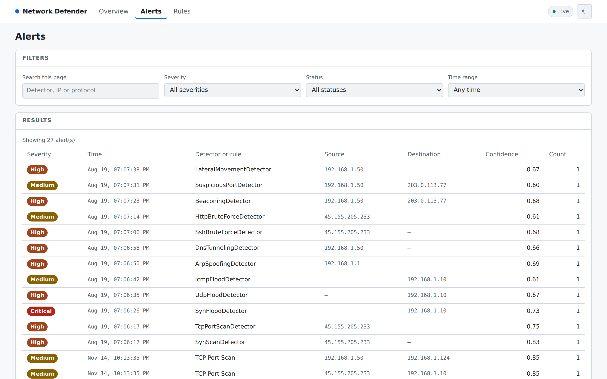
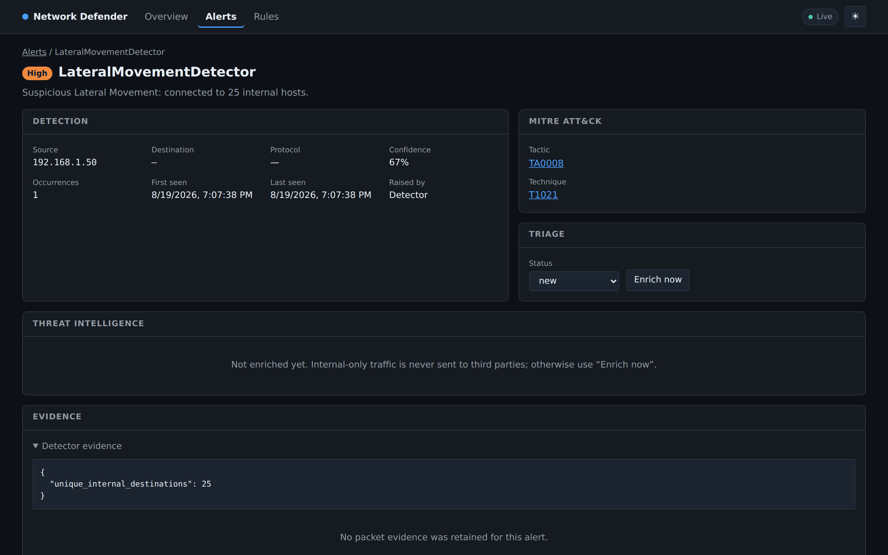
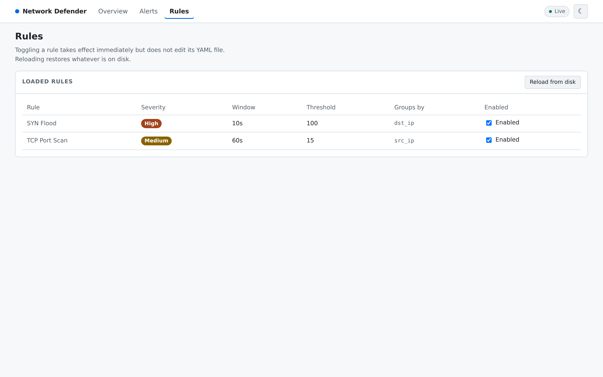
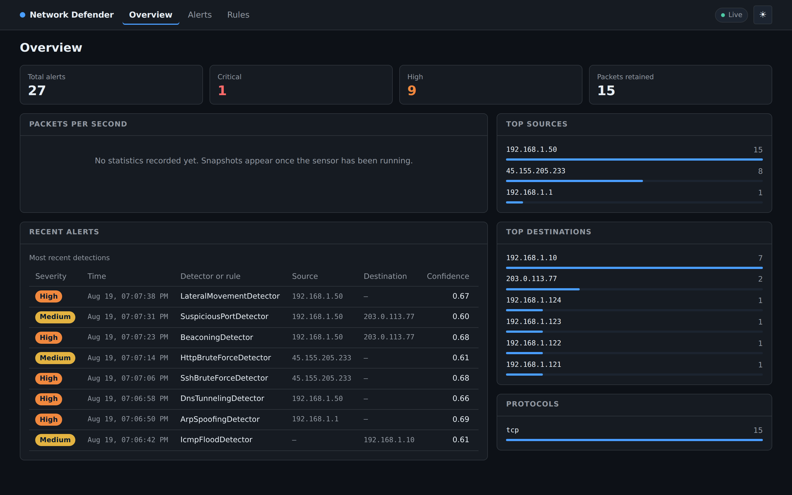
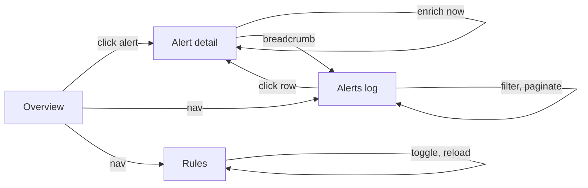

# Dashboard UI

React + TypeScript SPA served by FastAPI at `/dashboard`. Source in
[`frontend/`](../frontend/README.md); stack rationale in
[ADR 7](PLAN.md#adr-7-react--typescript--vite-for-the-dashboard); live-feed
design in [ADR 8](PLAN.md#adr-8-websocket-live-feed-polled-server-side).

## Screens

| Route | Purpose |
|---|---|
| `/dashboard` | Overview — live counters, throughput chart, top talkers, protocol mix, recent alerts. |
| `/dashboard/alerts` | Searchable, filterable alert log with server-side pagination. |
| `/dashboard/alerts/:id` | Alert detail — detection facts, MITRE mapping, triage, threat intel, packet evidence. |
| `/dashboard/rules` | Loaded rules, with runtime enable/disable and reload. |

## What it looks like

Screenshots of a live instance, taken against a database seeded by replaying
the sample captures. Regenerate them with:

```bash
cd frontend && npm run build
uv run network-defender api &
BASE=http://127.0.0.1:8000 ALERT=<alert-uuid> node frontend/shots.mjs
```

The capture script is committed for a reason: a screenshot nobody can
reproduce goes stale the first time the UI changes, and nobody notices,
because a stale screenshot still looks plausible.

### Overview


Four stat tiles across the top — total, critical, high, packets retained —
then two columns. The left holds throughput and the most recent detections;
the right holds top sources, top destinations and the protocol mix, each a
bar list rather than a pie, because the question is "which is biggest" and a
length answers that better than an angle.

The badge at top right is the live connection, and it is deliberately
prominent: a dashboard whose socket has quietly dropped shows numbers that
look current and are not. It reads **Live** when connected and
**Reconnecting** while it is not.

"No statistics recorded yet" in the throughput panel is correct here rather
than a bug — the counters come from the sensor's sampler, and this instance
replayed capture files rather than running one. An empty state that says why
it is empty is the difference between a working dashboard and a broken one.

### Alerts



Server-side pagination and filtering: the query goes to `/api/v1/alerts` with
`severity`, `status` and `hours`, so filtering a million alerts does not
transfer a million rows. Severity is a badge with a text label, never colour
alone.

### Alert detail



The screen an analyst spends their time on, in dark mode. Detection facts on
the left, MITRE tactic and technique linked out to ATT&CK on the right, triage
below that, then threat intelligence and the raw evidence the detector based
its decision on — `{"unique_internal_destinations": 25}` here.

Two things are worth pointing at. The threat-intelligence panel explains its
own empty state — *"Internal-only traffic is never sent to third parties"* —
which is an eligibility rule from [THREAT_INTEL.md](THREAT_INTEL.md) surfaced
where someone would otherwise assume a failure. And the evidence is shown as
the detector's own numbers rather than as prose, so the alert is arguable.

### Rules



The loaded signature rules, with runtime enable/disable and a reload button
that re-reads `rules/` from disk without restarting the sensor.

### Dark mode



Both modes are first-class, not an inverted filter. Every colour is a CSS
custom property switched by `data-theme` on `<html>`, and the severity palette
is chosen separately per mode so the contrast holds against each surface.

## Flows



**Triage path.** An analyst lands on Overview, spots a critical alert, opens
it, reads the description and evidence, checks the threat intel verdict, then
sets the status to acknowledged or false positive. Status controls live on the
detail page rather than the list on purpose: judging an alert should follow
reading it, not a guess from one table row.

**Investigation path.** From an alert, the source address in the intel panel
and the packet evidence answer "what else did this host do?" — the alerts log
filters serve the follow-up.

## Data flow

```
                    REST /api/v1  ──▶ historical queries, config, mutations
browser ─┤
                    WS /ws/live   ──▶ new alerts + counters, pushed
```

Live counters and the recent-alert list come from one shared WebSocket
(one connection per tab, not per component). The throughput chart is the
exception — it reads persisted snapshots over REST, because live counters reset
when the sensor restarts and a chart built on them would lose its history on
every deploy.

## Alert storms

The PRD requires the UI to survive bursts of thousands of alerts. Three
defences, at three layers:

1. **Server-side filtering and pagination.** The alerts log requests one page
   at a time. Fetching everything to filter in the browser would freeze the tab
   and waste the database indices built for these exact queries.
2. **Capped live state.** The WebSocket hook keeps at most 100 alerts in
   memory; older ones are a REST query away. Unbounded growth would leak memory
   and make React re-render an ever-longer list.
3. **Capped frames.** The server sends at most 50 alerts per frame, so a storm
   cannot produce a multi-megabyte message that stalls the browser.

## Theming

Dark by default, following the OS preference on first visit and remembering the
choice after that. The theme is applied by `public/theme.js`, loaded synchronously in `<head>`
**before first paint** — resolving it in React would render the default theme
first and flash the wrong colours on every load.

It is an external file rather than an inline script, and that is not a style
choice. The API serves this page under a Content-Security-Policy whose
`script-src` has no `unsafe-inline`, so the inline version was refused on
every load — causing precisely the flash it existed to prevent, while logging
a CSP violation nobody was reading.

Colours are CSS custom properties switched by `data-theme` on `<html>`, so
components reference semantic names (`--surface`, `--text`, `--sev-critical`)
and the theme decides the value.

## Accessibility review

Checked against WCAG 2.1 AA.

| Area | What was done |
|---|---|
| **Colour independence** (1.4.1) | Severity always renders its word — "Critical", not a red dot. Roughly 1 in 12 men has a colour vision deficiency, and red-versus-orange is exactly the distinction that fails. Ranked bars always print their count. The active nav item is marked by weight and an underline, not colour. |
| **Contrast** (1.4.3) | Severity palettes were chosen separately per theme; the light theme uses darker variants because the mid-tones that read well on `#0d1117` fail against white. |
| **Keyboard access** (2.1.1) | Every control is a native `button`, `a`, `input` or `select` — no click handlers on `div`s. Table rows link rather than intercepting clicks, so middle-click and open-in-new-tab work. |
| **Focus visibility** (2.4.7) | A `:focus-visible` outline is defined globally; browser defaults are frequently suppressed by resets, and a keyboard user cannot navigate what they cannot see. |
| **Skip link** (2.4.1) | First focusable element, visible on focus. Without it, reaching content means tabbing through the whole nav on every page. |
| **Headings** (1.3.1) | One `h1` per page, cards use `h2`. Screen reader users navigate by heading rather than reading linearly. |
| **Tables** (1.3.1) | Real `<table>` with `<th scope="col">` and a `<caption>`, so each cell is announced with its column name. |
| **Live regions** (4.1.3) | The connection badge is `role="status"` with `aria-live="polite"` — announced, but not interrupting mid-sentence. Errors use `role="alert"`; a loading message uses `role="status"`, since a spinner that resolves itself should not interrupt. |
| **Motion** (2.3.3) | `prefers-reduced-motion` disables transitions, for users where animation triggers vestibular symptoms. |
| **Zoom / reflow** (1.4.10) | Layout is fluid with `minmax(0, …)` grid columns; tables scroll horizontally rather than truncating data an analyst needs. |
| **Non-JS** | A `<noscript>` message points at the REST API, which needs no JavaScript. |

**Known gaps.** Contrast ratios were computed from the palette, not verified
with a contrast tool against rendered output. No screen-reader run-through has
been done — the semantics are correct by construction, but that is not the same
as testing with NVDA or VoiceOver.

## Nielsen's heuristics

| # | Heuristic | How the UI addresses it |
|---|---|---|
| 1 | Visibility of system status | Connection badge shows live/connecting/reconnecting. Every panel has explicit loading, error and empty states. Buttons show "Working…" while a request is in flight. |
| 2 | Match to the real world | SOC vocabulary — severity, triage status, MITRE tactic, top talkers — not invented terms. |
| 3 | User control and freedom | Filters are non-destructive and resettable; breadcrumb returns to the list; triage status can be changed back. Nothing is deleted from the UI. |
| 4 | Consistency and standards | One card component, one severity badge, one table style, one error envelope. MITRE IDs link to attack.mitre.org rather than being reinvented. |
| 5 | Error prevention | Severity, status and time range are dropdowns, so no invalid query can be typed. Page size is capped server-side. Changing a filter resets pagination, preventing a confusing empty page. |
| 6 | Recognition over recall | Filters show their current value; the search box states that it filters the loaded page; the rules page states that toggling does not edit the file. |
| 7 | Flexibility | Deep links to any alert are shareable and survive a reload. Dark and light themes. Keyboard-navigable throughout. |
| 8 | Aesthetic and minimalist design | The list shows a compact projection; full evidence and enrichment appear only on the detail page. |
| 9 | Error recovery | Errors state what failed in plain language and offer "Try again". The API's stable error codes surface as human messages, never raw exceptions. |
| 10 | Help and documentation | Empty states explain what would populate them ("Snapshots appear once the sensor has been running") rather than saying "no data". |

## Testing

```bash
cd frontend && npm test
```

22 tests covering the accessibility properties the components exist to provide
(severity readable without colour, tables announcing columns), the live feed's
reconnect and snapshot-versus-delta handling, the alert cap, and error
surfacing. They assert behaviour rather than snapshotting markup, which would
break on every styling change without catching a real regression.
